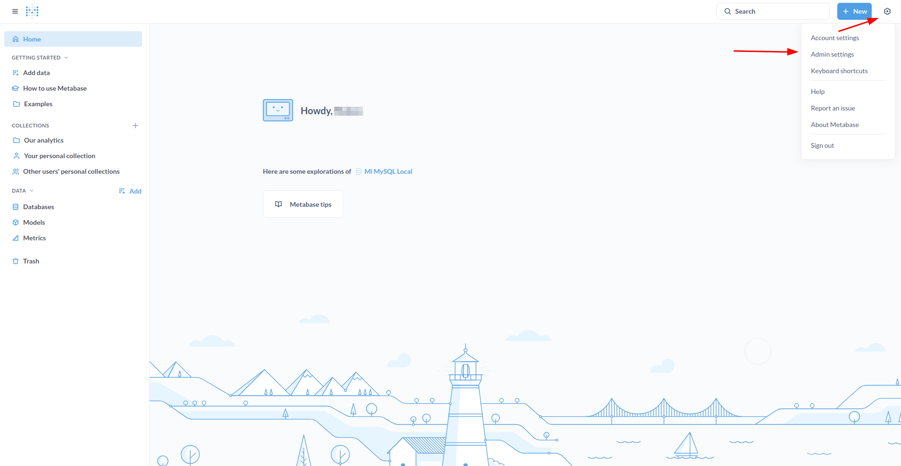
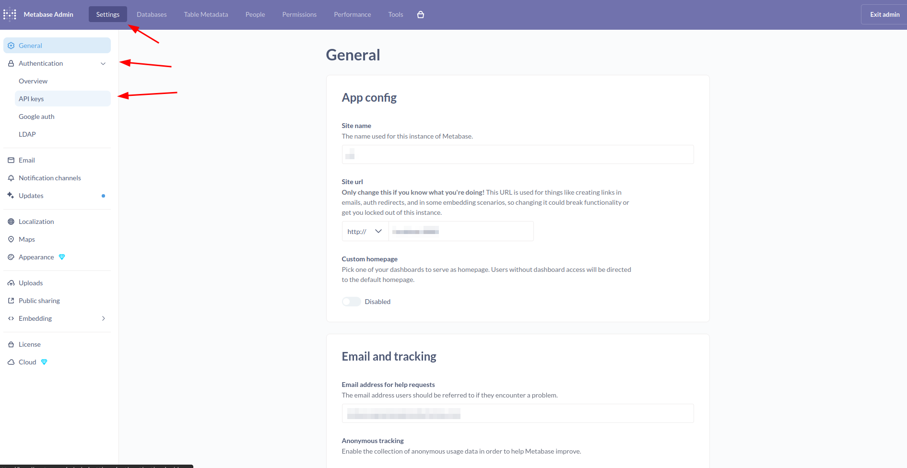
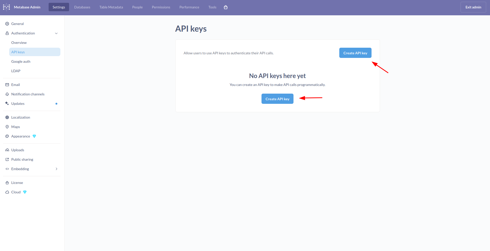
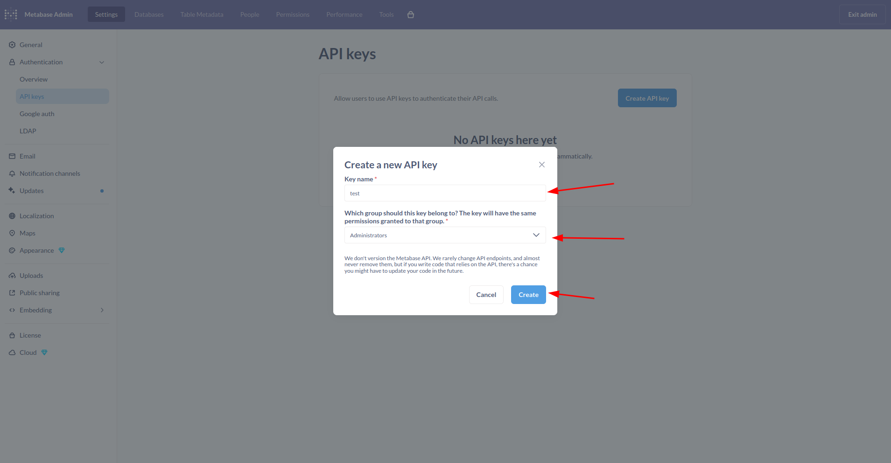
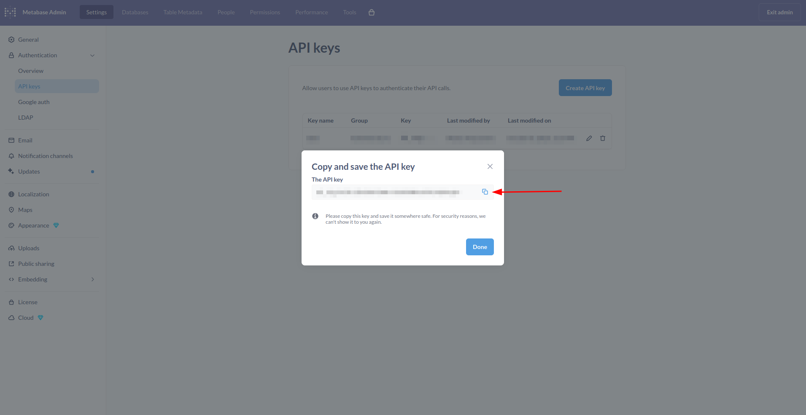

## Connector capabilities

1. What resources does the connector sync?
   The connector syncs users, groups and databases from Metabase.

2. Can the connector provision any resources? If so, which ones?
   No.

## Connector requirements
For the connector to work properly, install the free open-source version of Metabase v0.56.x.
Versions lower or upper than v0.56 are not supported.

* Official releases: https://github.com/metabase/metabase/releases
* Docker Hub images: https://hub.docker.com/r/metabase/metabase/tags?name=0.56

  Example:
  v0.56.0:
  ```
  docker run -d -p 3000:3000 \
  --name metabase \
  metabase/metabase:v0.56.x
  ```
The previous commands starts Metabase and exposes it on port 3000 of the server.
The connector requires the --metabase-base-url parameter, which should be set to the URL where this Metabase instance is accessible (e.g., https://metabase.customer.com for production).
For example:
If Metabase is running on a server with domain metabase.customer.com and port 443 (HTTPS), the base URL would be:
* --metabase-base-url https://metabase.customer.com
  For the previous case of docker commands, the base URL would be:
* --metabase-base-url http://localhost:3000

## Connector credentials
1. What credentials or information are needed to set up the connector? (For example, API key, client ID and secret, domain, etc.)

   Requires a base URL and an API Key. Args: --metabase-base-url, --metabase-api-key
 
   There is also the --metabase-with-paid-plan flag, to determine whether the connector is using the free open source version or a paid version of Metabase, 
   which will add the group_manager permission that makes sense in paid versions because it is not allowed to use it for free.
   By default, the flag is false.

   The required URL was defined in the connector requirements instructions
   To obtain the API key follow the next steps:
    1. In your Metabase address where the open source version was launched, click on the gear icon in the upper right section and click on admin settings:
       v0.56:   
       

    2. Click on authentication and API keys, then click on manage:
       v0.56:
       

    3. Click on create API key:
       v0.56:
       

    4. Fill in the required fields:
        * Key name: Enter any descriptive name (e.g. baton-connector).
        * Group: Select the administrators group as this will allow you to synchronize all connector resources with the API key.
        * Create the API key.
          v0.56:
          

    5. Save your API key as you will not be able to view it again:
       v0.56:
       

   

